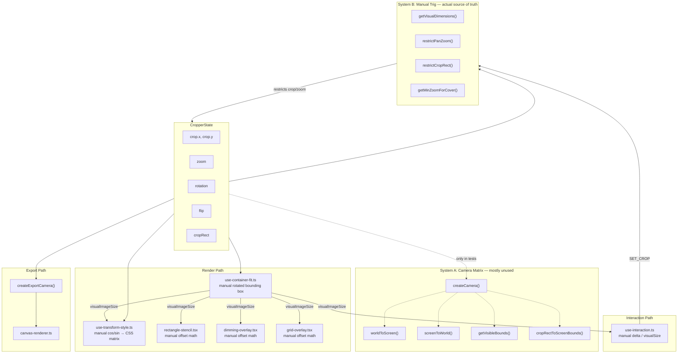
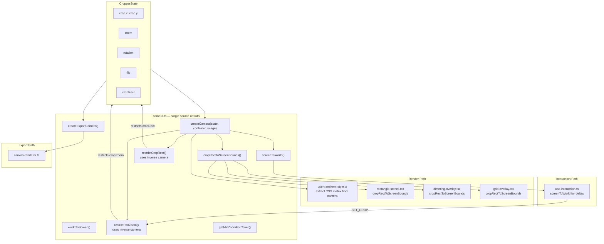

# Image Cropper Next — Architecture

## Coordinate Spaces

| Space | What lives here | Coordinates |
|-------|----------------|-------------|
| **World** | Image, crop rect | Normalized 0–1, origin top-left of image |
| **Camera** | View transform (zoom, pan, rotation, flip) | A `mat2d` mapping world → screen |
| **Screen** | DOM container, mouse events, CSS | Pixels relative to container |

## Current Data Flow

The camera matrix exists but is bypassed by most of the codebase. Six independent places compute the same rotated-bounding-box geometry manually.



### Problems with this design

1. **Two sources of truth.** The camera and the manual trig must agree on geometry. When they don't, restriction bugs appear (image edge visible inside crop area at certain rotations).
2. **Six places compute the same thing.** Rotated bounding box, visual dimensions, and coordinate offsets are computed independently in `use-transform-style`, `use-container-fit`, `rectangle-stencil`, `dimming-overlay`, `grid-overlay`, and the restriction functions.
3. **The camera is dead code.** `createCamera`, `worldToScreen`, `screenToWorld`, `getVisibleBounds`, and `cropRectToScreenBounds` are only used in tests and the export path. No hook or component calls them at render time.

## Target Data Flow

One camera matrix flows from `cropper.tsx` to every consumer. All coordinate transforms go through the camera. No duplicate geometry.



### What gets eliminated

| Removed | Replaced by |
|---------|-------------|
| `use-container-fit.ts` | Camera encodes container fit |
| `getVisualDimensions()` | Camera matrix |
| Manual offset math in stencil + overlays | `cropRectToScreenBounds(camera, cropRect)` |
| Manual cos/sin in `use-transform-style` | Camera mat2d → CSS `matrix()` |
| `visualImageSize` prop threading | Camera prop |
| `renderedImageSize` computation | Camera |

### UX invariant

> After `restrictPanZoom`, transforming the 4 crop corners through `screenToWorld(camera, corner)` must produce world points inside [0,1]×[0,1].

This is both the restriction algorithm AND the test. If the camera says it's covered, it's covered on screen — because the camera IS the screen transform.

## File Map

```
packages/image-cropper-next/
├── src/
│   ├── index.ts                          # Public API
│   ├── core/
│   │   ├── camera.ts                     # THE source of truth — createCamera, restrict*, worldToScreen, etc.
│   │   ├── constants.ts                  # DEFAULT_STATE, MIN_ZOOM, MAX_ZOOM
│   │   ├── types.ts                      # CropperState, Camera, StencilProps, etc.
│   │   ├── math/
│   │   │   └── rotation.ts               # normalizeRotation, degreesToRadians, radiansToDegrees
│   │   ├── transforms/
│   │   │   └── pipeline.ts               # TransformOperation replay
│   │   └── export/
│   │       └── canvas-renderer.ts        # createExportCamera → ctx.setTransform
│   ├── hooks/
│   │   ├── use-cropper-state.ts          # Reducer, enforceContainment
│   │   ├── use-interaction.ts            # Mouse/touch/keyboard → dispatch
│   │   └── use-transform-style.ts        # Camera → CSS matrix()
│   ├── components/
│   │   ├── cropper.tsx                   # Orchestrator — creates camera, passes down
│   │   ├── cropper.scss
│   │   ├── stencils/
│   │   │   └── rectangle-stencil.tsx     # Crop handles
│   │   └── overlays/
│   │       ├── dimming-overlay.tsx
│   │       └── grid-overlay.tsx
│   └── stories/
│       ├── rectangle-crop.story.tsx
│       └── style.css
```
