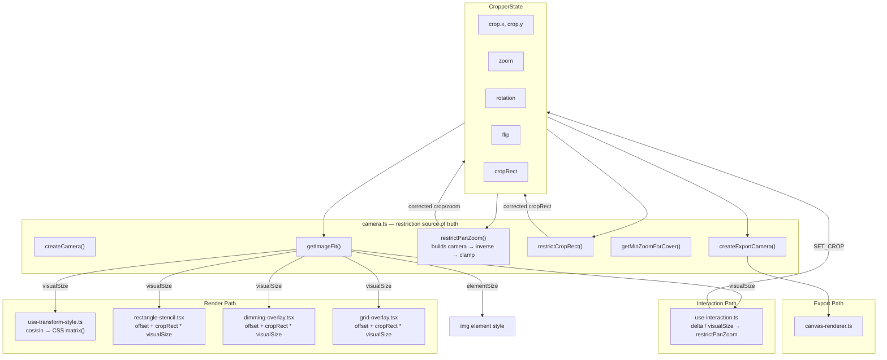

# Image Cropper Next — Architecture

## Coordinate Spaces

| Space | What lives here | Coordinates |
|-------|----------------|-------------|
| **World** | Image, crop rect | Normalized 0–1, origin top-left of image |
| **Camera** | View transform (zoom, pan, rotation, flip) | A `mat2d` mapping world → screen |
| **Screen** | DOM container, mouse events, CSS | Pixels relative to container |

## Data Flow

The camera is the source of truth for restriction (ensuring the image covers the crop). The render path uses lightweight manual math for CSS transforms and stencil positioning — these are simple, correct, and deliberately not routed through the camera to avoid prop-threading complexity.



### Design decisions

**Why restriction uses the camera but rendering doesn't:**
- `restrictPanZoom` builds a camera internally and projects crop corners through its inverse. This guarantees the restriction and rendering agree on geometry — the camera IS the screen transform.
- The render path (`use-transform-style`, stencils, overlays) uses simple manual math because the CSS transform operates in a different coordinate system (element-center origin vs container-center). Deriving CSS matrix from the camera mat2d would be more complex, not less.

**Why `getImageFit` exists:**
- `createCamera` needs to know the fitted image dimensions to build its matrix. `cropper.tsx` also needs them to size the `` element and compute `visualSize` for overlays. `getImageFit` is the shared contain-fit calculation used by both — no duplication.

**UX invariant:**
> After `restrictPanZoom`, transforming the 4 crop corners through `screenToWorld(camera, corner)` must produce world points inside [0,1]×[0,1].

This is both the restriction algorithm AND the test. If the camera says it's covered, it's covered on screen — because the camera IS the screen transform.

## File Map

```
packages/image-cropper-next/
├── src/
│   ├── index.ts                          # Public API
│   ├── core/
│   │   ├── camera.ts                     # Camera matrix, restriction, getImageFit
│   │   ├── constants.ts                  # DEFAULT_STATE, MIN_ZOOM, MAX_ZOOM
│   │   ├── types.ts                      # CropperState, Camera, StencilProps, etc.
│   │   ├── math/
│   │   │   └── rotation.ts               # normalizeRotation, degreesToRadians, radiansToDegrees
│   │   ├── transforms/
│   │   │   └── pipeline.ts               # TransformOperation replay
│   │   └── export/
│   │       └── canvas-renderer.ts        # createExportCamera → ctx.setTransform
│   ├── hooks/
│   │   ├── use-cropper-state.ts          # Reducer, enforceContainment
│   │   ├── use-interaction.ts            # Mouse/touch/keyboard → dispatch
│   │   └── use-transform-style.ts        # State → CSS matrix()
│   ├── components/
│   │   ├── cropper.tsx                   # Orchestrator — getImageFit, passes visualSize down
│   │   ├── cropper.scss
│   │   ├── stencils/
│   │   │   └── rectangle-stencil.tsx     # Crop handles (corner-only when ratio locked)
│   │   └── overlays/
│   │       ├── dimming-overlay.tsx
│   │       └── grid-overlay.tsx
│   └── stories/
│       ├── rectangle-crop.story.tsx
│       └── style.css
```
